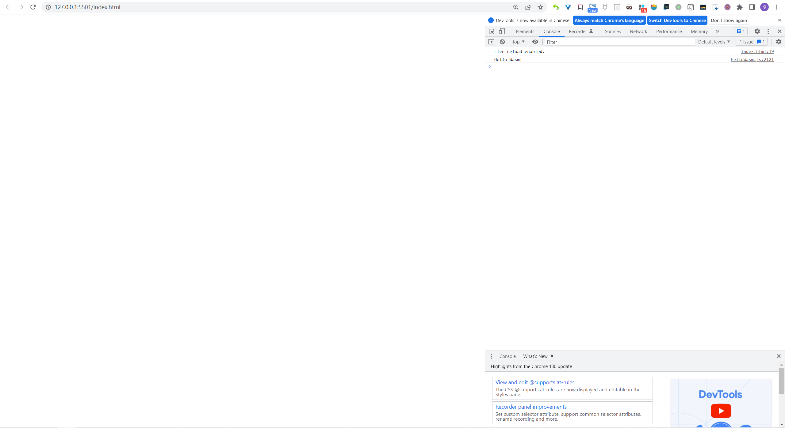

# webassembly-minimal-cmake-project
emscripten minimal cmake project

## Download and install emscripten SDK
[emscripten document](https://emscripten.org/docs/getting_started/downloads.html)

## Build with cmake
### Windows
Emscripten only support mingw32-make build toolchain,please install [mingw](https://github.com/mstorsjo/llvm-mingw) before
```bash
cmake .. -DCMAKE_TOOLCHAIN_FILE=path to\emsdk\upstream\emscripten\cmake\Modules\Platform\Emscripten.cmake -DCMAKE_CROSSCOMPILING_EMULATOR=path to/emsdk/node/14.18.2_64bit/bin/node.exe -G "MinGW Makefiles"

mingw32-make
```

or
```bash
emcmake cmake ..

mingw32-make
```

### Linux

ubuntu example

```bash
sudo apt-get install build-essential
```

```bash
emcmake cmake ..
make
```

## Run
open index.html

you will see browser console below.

## Screenshot
